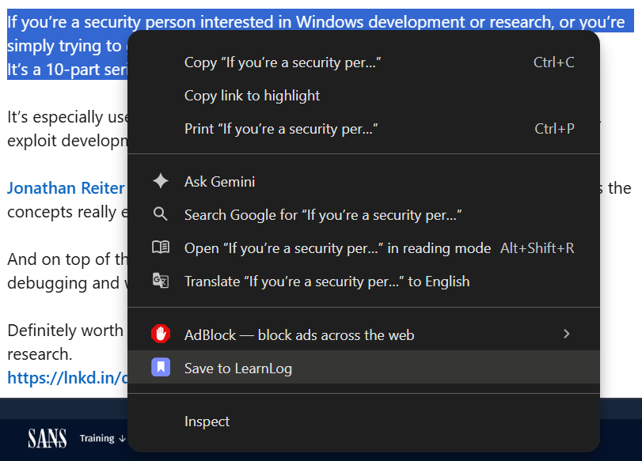
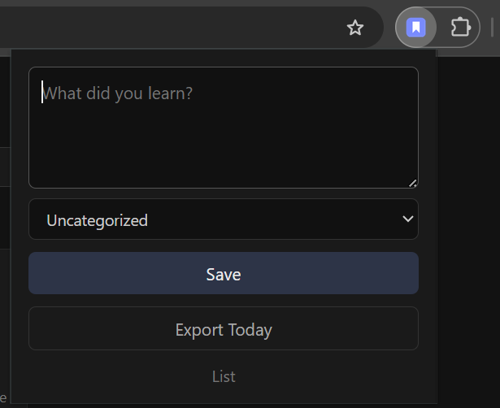
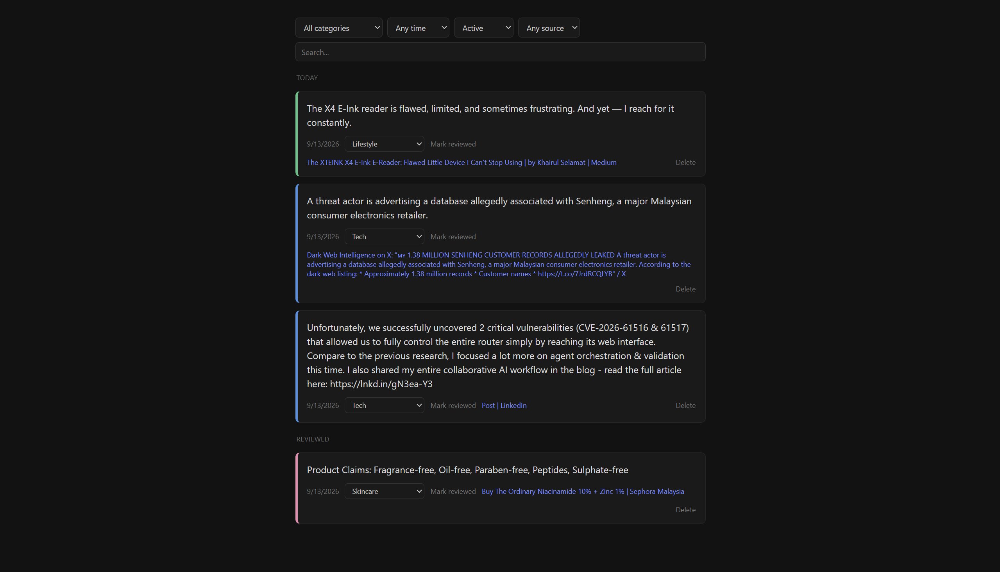

# LearnLog

A Chrome extension for capturing small things you learn during the day and reviewing them later with spaced repetition. Single user, fully local, no backend, no accounts.

## Why

Most "save for later" tools die because saving something takes too many decisions - a title, a tag, a category. LearnLog is built around one rule: **capture must be instant**. Highlight text, hit a hotkey, it's saved. No dialog, no required fields, no interruption.

Reviewing works the same way: one card, full screen, capped at 5 per session. No streaks, no "you missed 4 days" badges, no guilt.

## Features

- **Capture three ways**: a keyboard shortcut (`Ctrl+Shift+L` on a text selection), a right-click context menu item, or a quick-capture popup textarea.
- **Spaced repetition review**: notes resurface 1, 3, 7, then 21 days after capture, then archive automatically.
- **Categories**: optional, color-coded, never block a capture.
- **List view**: browse and search everything by category, date, status, or source - with inline recategorizing, delete, and "mark reviewed" without opening the review flow.
- **Soft delete**: nothing is ever destroyed immediately. Deleted notes get a 5-second undo toast and are hard-removed after 7 days.
- **Markdown export**: one click copies today's captures to the clipboard, formatted for pasting into an Obsidian daily note.
- **Theme-aware icon**: the toolbar icon follows your browser's light/dark theme automatically.

## Screenshots

**Right-click any selection and save it - no dialog, no fields to fill in.**

**Or capture from the toolbar popup - one textarea, an optional category, done.**

**Everything you've saved lives in the List view - filter by category, time, status, source, or just search.**

## Install

No build step - it's plain JS, HTML, and CSS.

1. Clone or download this repo.
2. Go to `chrome://extensions`.
3. Enable **Developer mode** (top right).
4. Click **Load unpacked** and select this folder.

## Usage

- Highlight text on any page and press `Ctrl+Shift+L`, or right-click and choose **Save to LearnLog**.
- Click the toolbar icon to quick-capture a thought, pick a category, or open the **List** view.
- Open `review.html` directly (no toolbar shortcut by design) when you want to run through what's due: click or press Space/Enter to advance a card, `d` to delete it.

## Tech

- Manifest V3, vanilla JavaScript (ES modules), no bundler, no framework, no external dependencies.
- All data lives in `chrome.storage.local` on your machine - nothing leaves your browser.
